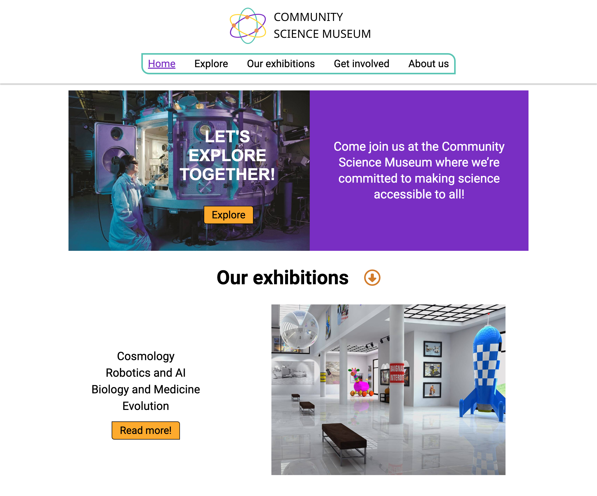

# Community Science Museum



[Community Science Museum](https://cv-semester-project-1.netlify.app/) is a fictional science museum website that I built for my semester project during my first year of Front-End Development at Noroff.

## Description

Community Science Museum is a fictional science museum website that I designed and built for my semester project during my first year of Front-End Development at Noroff.

**The brief for the assignment stated that:**
The website's primary audience consists of children aged 7-15 and families with young children. It aims to be informative and attractive, appealing to both middle school students and their parents. The website should cater to the audience's curiosity and intelligence, presenting information in an engaging manner. Its goal is to encourage visitors to explore the museum, and it must be responsive and user-friendly across different devices.

I made the design and wireframes in Figma, followed by building a fully responsive website using HTML and CSS.

## Built With

- HTML & CSS

## Getting Started

### Installing

1. Clone the repo:

```bash
git clone https://github.com/CharlotteValset/charlottevalset-semesterproject1.git
```

2. Install the dependencies:

```
npm install
```

### Running

To run the app, run the following commands:

```bash
npm run start
```

## Contributing

If you'd like to get involved in the project, please consider one of the following options:

- Submit a Pull Request:
  If you've made modifications or enhancements to the codebase, it is encouraged that you initiate a pull request (PR).

- Report an Issue:
  Should you encounter an issue or have a feature request, don't hesitate to create an issue. Please describe the problem or the enhancement you have in mind in as much detail as possible. This will assist me in tracking and prioritizing community input.

## Contact

Please contact me through:

[My Portfolio page](https://charlottevalset.no/portfolio/)

[My LinkedIn page](https://www.linkedin.com/in/charlotte-valset-6195b521a/)

## Acknowledgments

I would like to ackowledge my mentor, Eric Pretzinger - for guiding me and making me a better Front-End Developer.
